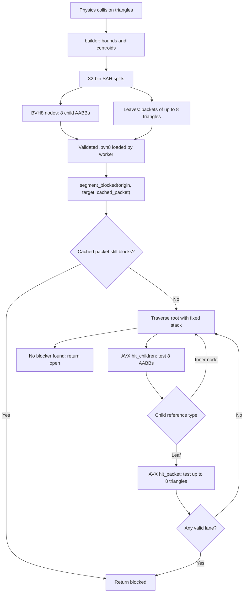

# BVH8 Ray Hit Test

## Overview
CS2FOW uses an offline-baked BVH8 over static map collision triangles to answer a boolean line-segment occlusion query: whether any wall triangle intersects the segment from a visibility origin to a target sample. It is not a nearest-hit renderer; the first valid blocker is sufficient, so traversal can return early.

## Responsibilities
- Organize accepted static triangles into an eight-child spatial hierarchy during baking.
- Reject most geometry with eight-wide AABB slab tests before exact triangle intersection.
- Test up to eight triangles simultaneously with AVX Möller-Trumbore math.
- Reuse the previously blocking triangle packet for temporally coherent visibility queries.
- Preserve fail-open behavior when runtime traversal or loaded geometry is uncertain.

## Involved Files & Symbols
- `src/core/bvh8.h:43-141` - `bvh8_node`, `triangle_packet8`, `ray_hit`, leaf-reference encoding helpers.
- `src/core/bvh8.cpp:31-118` - `packet_mask`, `hit_packet`, and `hit_children`.
- `src/core/bvh8.cpp:124-190` - AVX capability check, `packet_blocks_segment`, and `segment_blocked`.
- `src/core/builder.cpp:19-20,140-339` - 32-bin SAH splitting, eight-triangle packet construction, and recursive BVH8 node construction.
- `src/core/bvh8_format.cpp:246-355` - rooted-tree, bounds, reference, reachability, triangle-count, and depth validation.
- `src/baker/main.cpp:437-469` - imports physics triangles, builds/writes the BVH8, then reloads it for verification.
- `src/plugin/visibility_worker.cpp:324-383` - visibility query loop and per-recipient/target/origin packet cache.
- `tests/map_and_bvh_tests.cpp:576-587` - randomized comparison against scalar brute-force triangle tests and endpoint behavior.
- `tests/test_main.cpp:111-142` - 65,536-ray traversal performance gate.

## Architecture
The expensive partitioning and edge preparation happen in the baker. Runtime data is immutable and owned by the background visibility worker.

### Offline construction
- Each triangle receives an AABB and centroid.
- `best_split` evaluates 32 centroid bins on all three axes using approximate SAH cost: child surface area multiplied by triangle count.
- `build_node` repeatedly splits the range with the largest available gain until the node has at most eight children.
- A range with at most eight triangles becomes one `triangle_packet8`; larger ranges recurse into another node.
- Packet lanes store `v0`, `edge1 = v1 - v0`, and `edge2 = v2 - v0`, removing repeated edge calculations from runtime queries.

### Runtime data layout
- `bvh8_node` is 32-byte aligned and uses SoA arrays: `min_x[8]` through `max_z[8]`, followed by `child[8]`.
- `triangle_packet8` is also 32-byte aligned and uses one eight-float array per vertex/edge component.
- This layout maps directly to 256-bit AVX registers containing eight single-precision lanes.
- A leaf reference sets bit 31, stores `triangle_count - 1` in bits 28-30, and stores the packet index in the low 28 bits.

### AABB coarse test
`hit_children` broadcasts the segment origin and direction and performs a slab intersection against all eight child boxes simultaneously. For each axis it updates vector `near_t` and `far_t`; lanes are retained only when their interval overlaps the finite segment. Nearly parallel axes avoid division by zero and invalidate lanes whose origin is outside the corresponding slab. Invalid child references are removed from the final bit mask.

### Triangle exact test
`hit_packet` executes an AVX Möller-Trumbore test over eight triangle lanes. Vector masks reject degenerate or near-parallel triangles, invalid barycentric coordinates, and intersections outside `t > 1e-5` and `t < 1 - 1e-5`. A leaf-count mask excludes unused packet lanes.

### Traversal and early exit
`segment_blocked` first retests `cached_packet`. On a cache hit it skips the tree. Otherwise it traverses from node zero with a fixed `uint32_t stack[512]`, tests child boxes in eight-wide batches, immediately tests discovered leaves, and returns on the first blocking packet. Inner nodes are pushed for later traversal. If all candidates are rejected, it returns `blocked=false`.

## Dependencies
- AVX and OS XSAVE support, checked by `cpu_supports_avx`; vector code uses `<immintrin.h>`.
- Immutable, fully validated `bvh8_data` loaded before the visibility worker starts.
- Static collision triangles produced by the baker's physics-GLB import and filtering recipe.
- Background visibility worker ownership; BVH traversal is not performed inside `CheckTransmit`.

## Notes
- The query parameterization uses `direction = target - origin`, so the relevant segment is `t in [0,1]`; epsilon deliberately excludes contact exactly at the origin or target.
- The cached-packet fast path tests all eight lanes. Unused packet lanes are zero-initialized and rejected as degenerate by the determinant mask.
- Segment traversal processes hit lanes in ascending lane order and inner nodes with LIFO stack order. It does not sort candidates by `near_t`, so its acceleration comes primarily from spatial pruning, AVX width, packet reuse, and first-hit early exit.
- Fixed-stack exhaustion returns the default `ray_hit` with `blocked=false`, preserving the project's fail-open safety policy.
- Loaded files are validated for one rooted tree, unique parents, reachable nodes/packets, valid bounds/references, consistent depth/triangle counts, and CRC before use.
- There is no BVH2 implementation or BVH8-versus-BVH2 benchmark in the repository. The code does compare BVH8 correctness with scalar brute force, and the benchmark harness requires the average time for 65,536 cached rays to remain below 25 ms.
- The same BVH8 geometry is also consumed by capsule occlusion rendering, but that path uses a near-depth heap traversal rather than `segment_blocked`'s unsorted fixed stack.

## Callers
- `src/plugin/visibility_worker.cpp` - AABB-corner and muzzle visibility rays, with persistent blocking-packet reuse.
- `src/core/visibility_sampling.cpp` - safe-origin checks and wall-clipped destinations.
- `src/core/smoke_occlusion.cpp` - verifies clearance segments against static geometry.
- `tests/map_and_bvh_tests.cpp` and `tests/test_main.cpp` - correctness and performance coverage.
